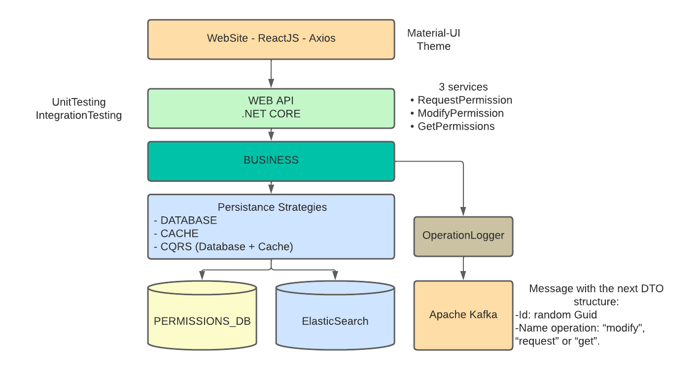

# 5D by Mauricio Gracia Gutierrez

To solve the proposed challenge this architecture will be used, each box is and abstraction layer but it does not represent a container

The folder structure is:
 - WebApi - contains the .NET CORE REST API
 - WebApiTests - contains the unit tests and the integration tests
 - prepare - contains artifacts used to bootstrap the solution using docker-compose
 - web-site - contains the ReactJS web site
 - proxy - created while trying to solve a CORS issue - WORK IN PROGRESS
